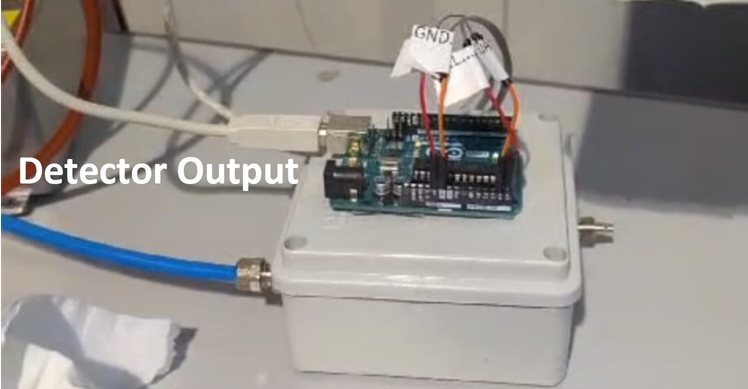

# TPH monitor based on BME680 sensor

The sensor is placed inside an electrical derivation box which is gas thigh. The box is mounted in series to MANGOlino output gas line.

## Basic instructions
Send a byte through serial port to Arduino

- **R**: Arduino replies with *temperature;pressure;humidity;VOC* [K,Pa,%,$\Omega$]
- **W**: To return the detector where the Arduino is connected (KEG or MANGOlino)
- **K**: Reset the Arduino, equivalent to click the reset button

## TPH sensor

The sensor is a BME 680 that measure Temperature, pressure, humidity and VOC (volatile organic compounds).
Arduino talks to it via I2C. the sensor requires +5V and GROUND. **SDA and SCL are respectively connected to A4 and A5 analog input.**
| Wire Name      | Pin On Arduino
| :---:        |    :----:   |
| VCC      | Anywhere 5V       |
| GND   | Anywhere GND        |
| SDA   | A4        |
| SCL   | A5        |